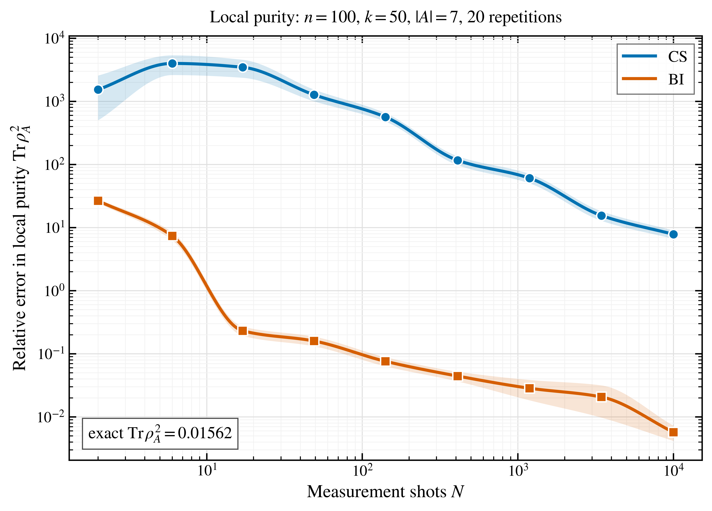
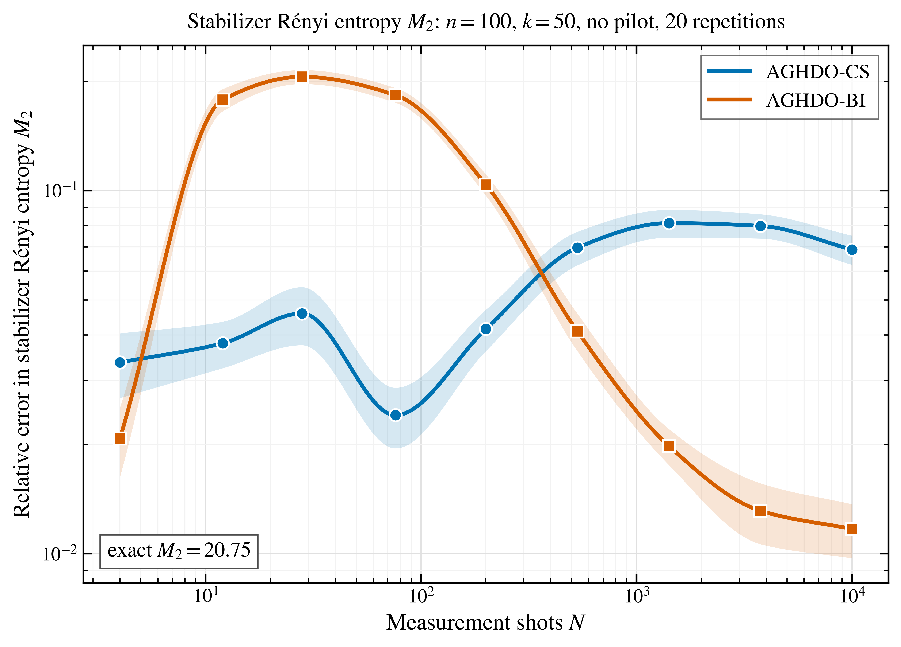

# Correlation-Informed Quantum Learning

[](https://github.com/teddematteo/corr-inf-quant-learning/actions/workflows/ci.yml)
[](LICENSE)
[](pyproject.toml)

Official research code accompanying the article
[**A Few Constrain Many: Correlation-Enhanced Learning of Many-Body Quantum Systems**](https://arxiv.org/abs/2609.39935).

**Authors:** Matteo Tedde and Davide Girolami<br>
**Affiliation:** Politecnico di Torino<br>

This repository implements correlation-informed measurement strategies for
learning properties of many-body quantum systems. It compares uniform
local-Pauli classical shadows (CS), correlation-informed acquisition (CorInf),
and their scalable AGHDO/QNS estimators on rotated two-dimensional cluster states.

## Main results

### Local purity

[](figures/cluster_purity_relative.pdf)

### Global stabilizer Rényi magic

[](figures/cluster_magic_relative.pdf)


## Features

- Exact Pauli-correlator oracle without allocating a \(2^n\) state vector.
- Adaptive, correlation-informed measurement design for local purity and global
  stabilizer Rényi magic.
- Uniform and correlation-informed measurement streams evaluated under the same
  shot budget.
- Scalable AGHDO/QNS estimators trained directly from measurement records.

## Installation

Python 3.11 or newer is required.

```bash
git clone https://github.com/teddematteo/corr-inf-quant-learning.git
cd corr-inf-quant-learning
python -m venv .venv
source .venv/bin/activate  # Windows: .venv\Scripts\activate
python -m pip install -e ".[dev]"
```

Install only the runtime dependencies with:

```bash
python -m pip install -e .
```

## Quick start

```python
from corr_inf_quant_learning import SimulationConfig, run_benchmark

config = SimulationConfig(
    n_qubits=16,
    k_rotations=6,
    subsystem_size=4,
    property="PURITY",
    methods=("CS", "CorInf"),
    post_shots=256,
    repetitions=3,
)

result = run_benchmark(config)
print(result.truth)
print(result.estimates)
```

Run the complete comparison suite from the command line:

```bash
corr-inf-benchmark --help
corr-inf-benchmark --post-shots 10000
```

Generated plots are written to `figures/` by default.

For an interactive workflow, start JupyterLab from the repository root and
open [`notebooks/corInfQuantLearning.ipynb`](notebooks/corInfQuantLearning.ipynb).

## Repository layout

```text
src/corr_inf_quant_learning/  Python implementation
notebooks/                    Interactive benchmark workflow
figures/                      Main figures in PNG and PDF formats
```

## Reproducibility checks

```bash
ruff check .
python -m build
python -m corr_inf_quant_learning --help
```

## Citation

If this repository contributes to your research, please cite the original
article:

> Matteo Tedde and Davide Girolami, [**A Few Constrain Many:
> Correlation-Enhanced Learning of Many-Body Quantum Systems**](https://arxiv.org/abs/2609.39935)

Repository-level citation metadata is also available in [CITATION.cff](CITATION.cff).

## License

Released under the [MIT License](LICENSE).
